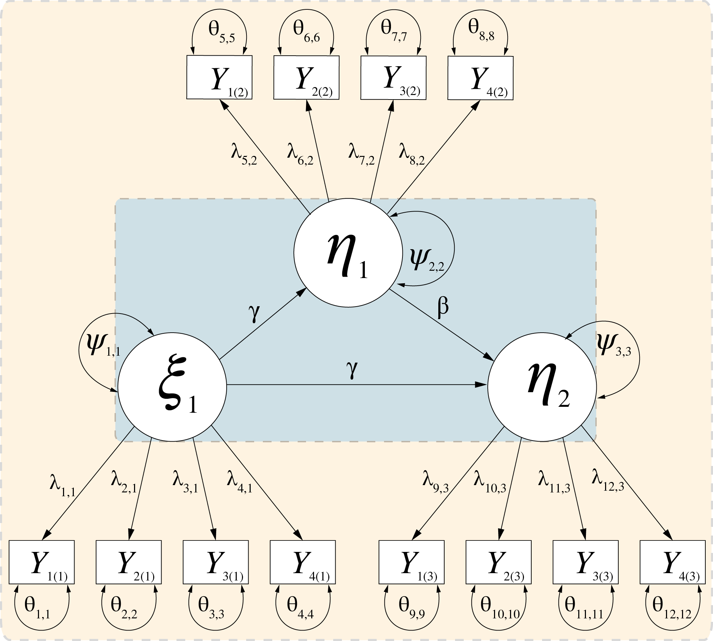
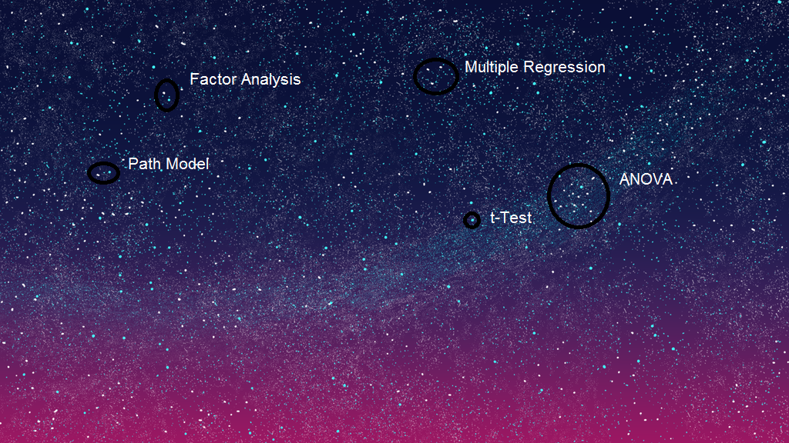
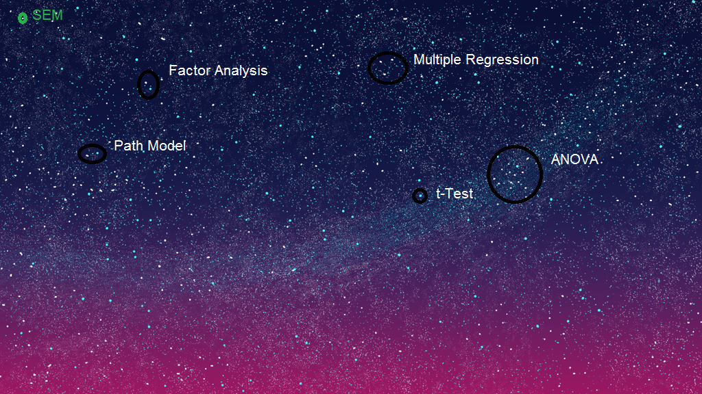
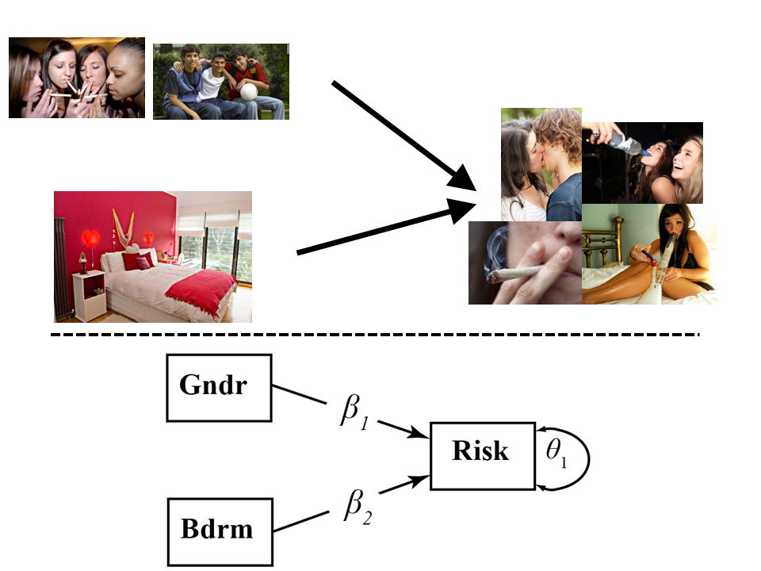
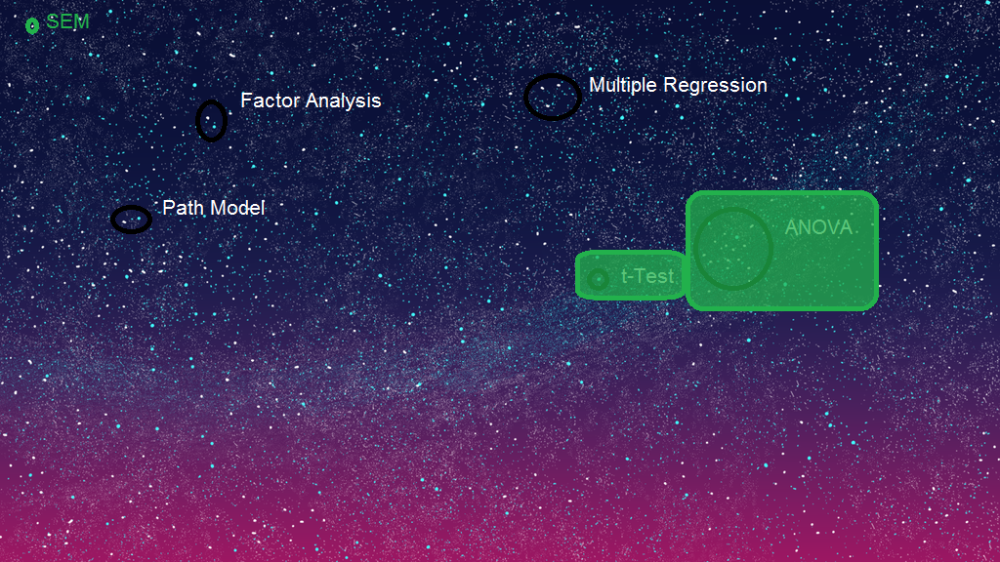
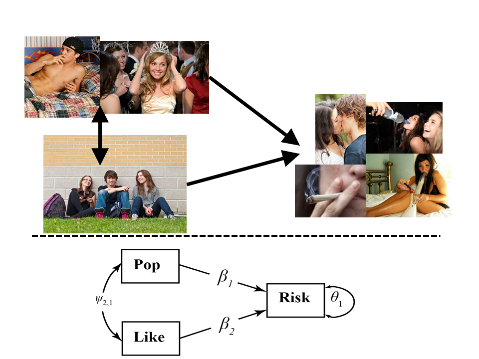
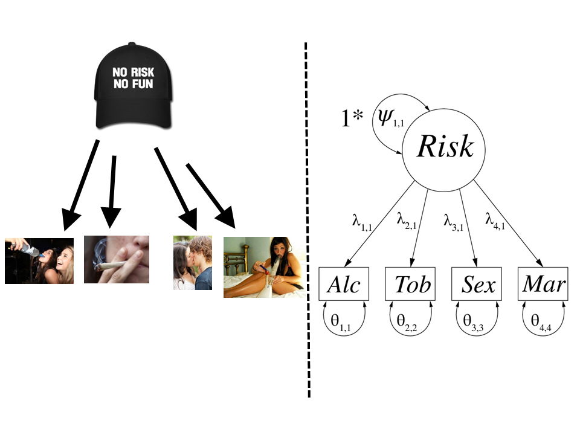
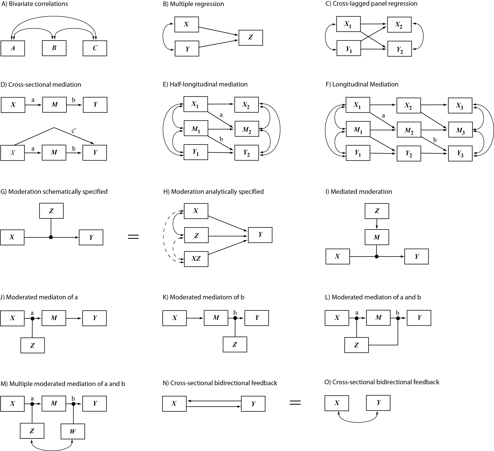
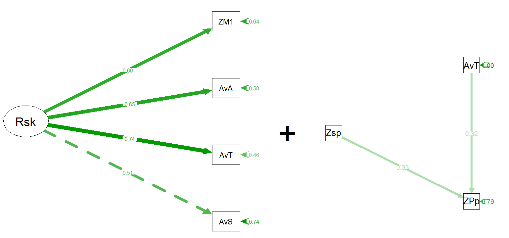

<!-- WELCOME & FLYER-SLIDE -->

<div align="center">

</div>

---

<!-- Overview -->

## What is SEM?
<br><br>
## What can SEM do?
<br><br>
## What are the pitfalls of SEM?
<br><br>

---

<!-- SNEAK PREVIEW -->

<div align="center">

</div>

---

Equip yourselves!

<div align="center">

</div>

### 

---

<!-- HEADLINE ONLY -->

## Structural Equation Modelling (SEM)

---

## A Million years ago...

---

## (about 1970)

---

## The Stats Universe!

<div align="center">

</div>

---

<!-- STARRY NIGHT 2: t-Test -->

## The Stats Universe

<div align="center">

</div>

---

<!-- STARRY NIGHT 3: ANOVA -->

## The Stats Universe

<div align="center">

</div>

---

<!-- STARRY NIGHT 4: MultReg -->

## The Stats Universe

<div align="center">

</div>

---

<!-- STARRY NIGHT 5: FA -->

## The Stats Universe

<div align="center">

</div>

---

<!-- STARRY NIGHT 6: PM -->

## The Stats Universe

<div align="center">

</div>

---

<!-- STARRY NIGHT 7: semI -->

## The Stats Universe

<div align="center">

</div>

---

<!-- STARRY NIGHT 8: SEMII -->

## The Stats Universe

<div align="center">

</div>

---

<!-- TRANSITION INTRO -> JOURNEY -->

## The World of
## Structural Equation Modelling

<div align="center">

</div>

---

<!-- TRANSITION INTRO -> JOURNEY II -> Question -->

## What can
## SEM do?

<div align="center">

</div>

---

<!-- JOURNEY
to explore how SEM managed to conquer a large part of the universe of statistics
within few decades, let us take a look at what SEM can do...
...in a context that is a bit more down to earth
and better graspable for us...
...Sex!
-->

## What can
## SEM do?

<div align="center">

</div>

---

# Research Question

## How are Risk Behaviour and Social Status Related in Adolescence?

<div align="center">

</div>

---

## Data

### *N* = 408 students, about 17 years, from Austria, the Netherlands 

* Risk behaviour
    + Sex (Intercourse) Drugs (Tobacco, Alcohol, Marijuana)

* Social status
    + Popularity  ("who is popular?") Likeability ("who yo dou like?")

* Prosocial behaviour
    + Who is nice? Who is helpful? Who cheers others up?

* Antisocial behaviour
    + Who is mean? Who bullies others? Who excludes others?
 
* Positive characteristics
    + e.g., Sporty, good in school

---

## Software preparation

open *R*!

```{r, eval = FALSE, tidy = TRUE}
# Set working directory
# Change into your own directory
# Where the workshop-files are placed!
# Attention: When you copy the directory from explorer,
# change backslashes into slashes!
setwd("C:/Users/petere/Desktop/SEM_WS")

```

---

## Software preparation

```{r, eval = FALSE}

# Install packages needed for analysis
 install.packages("lavaan", "semPlot", "psych")

# Load packages needed for analysis
library(lavaan) # Package for SEM
library(semPlot) # Package to draw SEMs
library(psych) # Package for descriptive statistics

```

---

## Loading and preprocessing the data

```{r, eval = FALSE}

# Read data from SPSS file into dataframe
risk <- read.table("riskdata.txt")

View(risk)

```

---

## Does gender influence the frequency of risk behaviour?

<div align="center">

</div>

---

<!-- What do we use? -> The t-Test! -->

## The Stats Universe

<div align="center">

</div>

---

<!-- What do we use? -> The t-Test! -->

## The Stats Universe

<div align="center">

</div>

---

## t-Test

```{r, eval = FALSE}

# 2.2 Using regular t-test
summary(lm(risksum~Gender))

# 2.3 Using SEM t-test model
model2 <- '# Regressions: t-test model
           risksum~Gender'
fit_model2 <- cfa(model2,
                  data=risk,
                  missing="ml")
summary(fit_model2)

```

---

## Does risk behaviour depend on adolescents' gender and bedroom availability?

<div align="center">

</div>

---

<!-- What do we use? -> An ANOVA! -->

## The Stats Universe

<div align="center">

</div>

---

<!-- What do we use? -> An ANOVA! -->

## The Stats Universe

<div align="center">

</div>

---

## ANOVA


```{r, eval = FALSE}

## 3 Model 3
# ANOVA:
# Boys vs. Girls, Bedroom "availability"

# 3.1 Graphical inspection
plot(risksum~Bedroom) # Box plot

# 3.2 Using regular ANOVA
summary(lm(risksum~Gender + Bedroom))

# 3.3 Using SEM ANOVA model
model3 <- '# Regressions: ANOVA model
risksum~Gender + Bedroom'
fit_model3 <- cfa(model3,
                  data=risk,
                  missing="ml")
summary(fit_model3)
summary(lm(risksum~Gender + Bedroom))

```


---

## Does risk behaviour depend on adolescents' popularity and likeability?

<div align="center">

</div>

---

<!-- What do we use? -> A multiple regression! -->

## The Stats Universe

<div align="center">

</div>

---

<!-- What do we use? -> A multiple regression! -->

## The Stats Universe

<div align="center">

</div>

---

## Multiple Regression


```{r, eval = FALSE}

# 4.1 Using regular multiple regression
summary(lm(risksum~ZPop+ZLike))

# 4.2 Using SEM
model4 <- '# Regression: Multiple
          risksum~ZPop+ZLike'
fit_model4 <- cfa(model4,
                  data=risk,
                  missing="ml")
summary(fit_model4)
summary(lm(risksum~ZPop+ZLike))
```

---

## Is there a general tendency to engage in risk behaviour?

<div align="center">

</div>

---

<!-- What do we use? -> A factor analysis! -->

## The Stats Universe

<div align="center">

</div>

---

<!-- What do we use? -> A factor analysis! -->

## The Stats Universe

<div align="center">

</div>

---

## Confirmatory Factor Analysis

```{r, eval = FALSE}

model5 <- '# CFA: Unidimensional model
          # Risk Behaviour Factor
          Risk=~AvrSex + AvrTob + AvrAlc + ZMar1
          '
fit_model5 <- cfa(model5,
                  data=risk,
                  missing="ml")
summary(fit_model5,
        fit.measures = TRUE,
        standardized = TRUE)

```

---

## Does engagement in sports lead to less smoking, in turn leading to less popularity?

<div align="center">

</div>

---

<!-- What do we use? -> A Path analysis/mediation model! -->

## The Stats Universe

<div align="center">

</div>

---

<!-- What do we use? -> A Path Analysis/mediation model! -->

## The Stats Universe

<div align="center">

</div>

---

## Path Analysis

```{r, eval = FALSE}

model6 <- '# Mediation model
# Risk Behaviour Factor
ZPop ~ AvrTob + Zsport
AvrTob ~ Zsports
'
fit_model6 <- cfa(model6,
                  data=risk,
                  missing="ml")
summary(fit_model6,
        fit.measures = TRUE,
        standardized = TRUE)

```

---

## Summary: What can SEM do?

- Estimate classical models
    * Advantages in SEM:
   "Corrections" for Missing data, non-normality, clustered sampling

---

## So What?

---

## So What?

<div align="center">

</div>

---

## Full SEM power!
## FIRST STRIKE

<div align="center">

</div>

---

## Full SEM power!
## FIRST STRIKE

<div align="center">

</div>

- + Item Response Theory (IRT)

- + Multilevel  (hierarchical/mixed) Modelels


<!-- Mention Item Reponse Theory (IRT) -->

---

## Full SEM Power!
## SECOND STRIKE

Combine *Latent Variables*
with *Structural* (Path) Models

<div align="center">

</div>

---

## Full SEM Power!
## SECOND STRIKE

Examine *Complex Theories*
with *Error Free* Constructs

<div align="center">

</div>

---

<div align="center">

</div>

---

## How does this work?

- Variance-covariance matrix
    * **Model-implied** vs. **empirical**

<div align="center">

</div>

---

## A "Small " Theory...

```{r, eval = FALSE}

model7 <- '# SEM:
# Risk Behaviour Factor
Risk =~ AvrSex + AvrTob + AvrAlc + ZMar1
# Regressions
ZPop ~ Risk
ZLike ~ Risk
# Correlation
ZLike ~~ ZPop
'
fit_model7 <- sem(model7,
                  data=risk,
                  missing="ml",
                  estimator="MLR",
                  fixed.x=FALSE)
summary(fit_model7,
        fit.measures = TRUE,
        standardized = TRUE)

```

---

## How does this work?

- Variance-covariance matrix
    * **Model-implied** vs. **empirical**

<div align="right">

</div>


---

## A "Small" Theory...

<div align="center">

</div>

---

## The Full Model

```{r, eval = FALSE}

model8 <- '# SEM:
          # Risk Behaviour Factor
          Risk =~ AvrSex + AvrTob + AvrAlc + ZMar1
          ProSoc =~ Zcheers + Zhelpful + Znice
          AntSoc =~ Zmean + Zbullies + Zexclude
          # Regressions
          ZPop ~ Risk + ProSoc + AntSoc + Zattrac + Zsports
          ZLike ~ ProSoc + AntSoc + Zattrac        
          # Correlations
          ZPop ~~ ZLike
          Risk ~~ Zsports
          Risk ~~ 0*ProSoc
'
fit_model8 <- sem(model8,
                  data=risk, missing="ml",
                  estimator="MLR", fixed.x=FALSE)
summary(fit_model8, fit.measures = TRUE,
        standardized = TRUE)

```

---

## The Full Model

<div align="center">

</div>

---


## Pitfalls

---

## Modeling weak measurement

- SEM is not a panacea for weak measures!
    * Questionnaire, coding system,...
    
- High "internal consistency" reliability (Cronbach's Alpha) was yesterday!
    * Not needed for SEM

---

## Sem vs. IRT

- Item Response Theory
    * *Same model* as confirmatory factor analysis (CFA) in SEM
    * With categorical indicators
    * Valid estimation possible in Mplus, Lavaan (R)
    * Use weighted least squares (WLS) estimator

---

## Software

- R

- Mplus

- LISREL, OpenMX, SEM package, Stata

--- 

## Figures

- AMOS Software: Graphical Interface

<div align="center">

</div>

- Mplus software: Diagram editor

- R software: Lavaan + semPlot packages

- Power point: Works fine!

---

## Figures

- Adobe Illustrator: THE King of SEM figures
    * See Little, 2013

<div align="center">

</div>


---

## Learn more!: Software-based

- Geiser, 2013
    * Mplus-based

- Byrne, 2011
    * Various Editions: Mplus, AMOS, LISREL

- Beaujean, 2014
    * R: Lavaan-package

---

## Learn more!: Advanced SEM

- Longitudinal models
    * Little, 2013; McArdle & Nesselroade, 2014
    * Great books!
    * Hoyle, 2012
    * Kline, 2011

---

## Model fit statistics

- Does my model adequately represent the data?
    * Can I interpret the values of my output?

- Fit statistics: RMSEA, CFI, SRMR
    * Rules of thumb "for beginners"

- Strong theory, inspection of residuals and modifications
    * "You" know what to expect from the data
    * Residual variances and covariances
    * Modifcation indices: What would improve model fit?

---

## Model fit 1/3

- Hu & Bentler, 1999: Rules of thumb
    * But see Heene, 2013

- RMSEA
    * Chi-square/number estimated parameters
    * "Should be" <.06

- CFI
    * Comparison to strongly constrained null model
    * "Should be" >.90

- SRMR
    * Average residual variance/covariance
    * "Should be" <.11

---

## Model fit 2/3

- Rules of thumb are **not** mandatory!

- Look at modification indices
    * What would **improve** model fit?
    
- Look at residual variances/covariances
    * Where did I not model something that is there?

- See Little, 2013

---

## Model fit 3/3

- **Theory** tells most about model fit!

---

## Overblown fancyness

- Don't assess 27 scales!
    * SEM won't "reveal" anything


<div align="center">

</div>

- Stick to **theory**!
    Little, 2013

---

## Enjoy SEM responsibly! :)

---

# References

- Beaujean, A. A., (2014). Latent Variable Modeling Using R: A Step-by-Step guide. Routledge.
- Byrne, B. (2011). Structural Equation Modeling with Mplus: Concepts, Applications, and Programming. Routledge & Chapman.
- Geiser, C. (2012). Data Analysis with Mplus. New York: Guilford Press.
- Hoyle, Rick H. Handbook of Structural Equation Modeling. New York: Guilford Press.
- Hu, Li-tze, and Peter M. Bentler. "Cutoff Criteria for Fit Indexes in Covariance Structure Analysis: Conventional Criteria versus New Alternatives." Structural Equation Modeling: A Multidisciplinary Journal, 1-55. doi:10.1080/10705519909540118.
- Kline, R. B. (2011). Principles and Practice of Structural Equation Modeling (3rd ed.). New York: Guilford Press.
- Little, T. (2013). Longitudinal Structural Equation Modeling. New York
- McArdle, J. J., & Nesselroade, J. R. (2014). Longitudinal Data Analysis Using Structural Equation Models. American Psychological Association.
