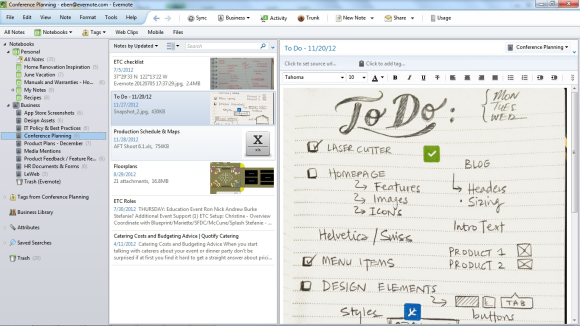

## MuSt Peer Mentoring: *Est. 2009*

**Ziele**

- *Austausch* über Methoden und Statistik

- *Gemeinsames Erlernen* von Methoden und Statistik

- *Karriereförderung*

## MuSt Peer Mentoring: *Est. 2009*

**Treffen**

- Mind. 1x im Monat

- Stammtische, Workshops, Think-tanks, Retraite

## MuSt Peer Mentoring: *Stammtische*

- 1 Stunde

- Quantifizierung von qualitativen Daten, Experience sampling Methoden, Annahmen von Regressionsmodellen, Kausalität

## MuSt Peer Mentoring: *Workshops*

- 1-3 Tage

- Strukturgleichungsmodellierung, Mehrebenenanalysen, Bayesianische Statistik, R Software

## MuSt Peer Mentoring: *Think-Tanks*

- Spontane Einberufung

- Schwieriges Review, Analyseprobleme, Interpretationen, Anträge

## MuSt Peer Mentoring: *Retraite*

- Drei Tage Rückzug

- Vorträge, Arbeitsgruppen, Schreib(Rechen)zeit, Zeit verbringen

## MuSt Peer Mentoring: *Karriereförderung*

- Mehrmals im Jahr

- Diskussionen mit Alumni, Karriere-Coaching, Austausch mit Beiräten

## MuSt Peer Mentoring: *Teilnahme*

- Docs/PostDocs

- Vorrangig UZH

- **Motivation** :)

# mustpeermentoring@gmail.com

thank you.