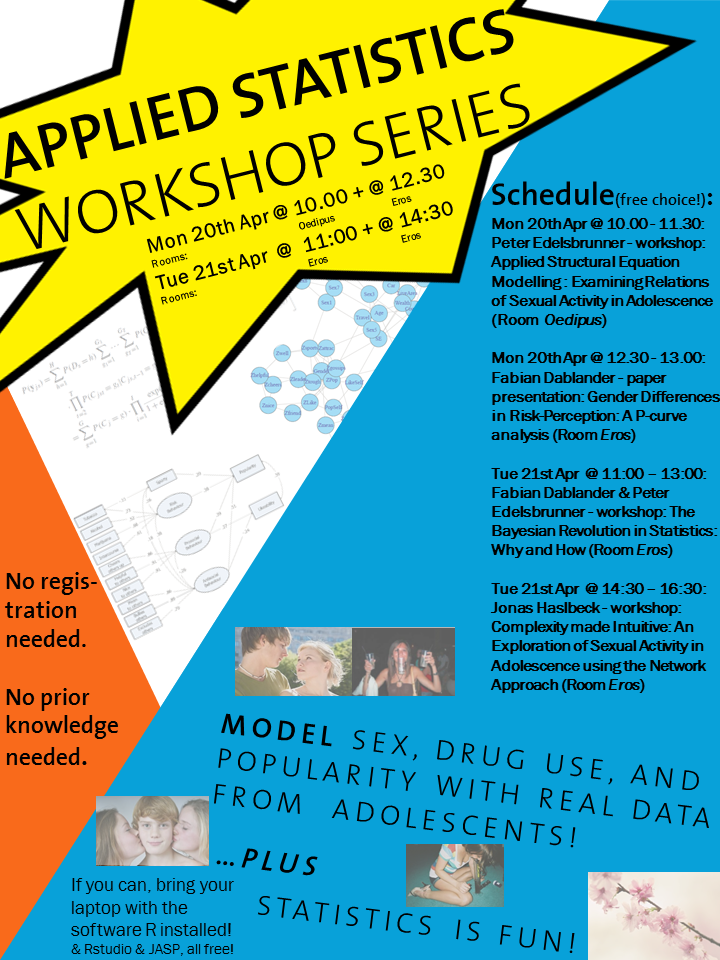
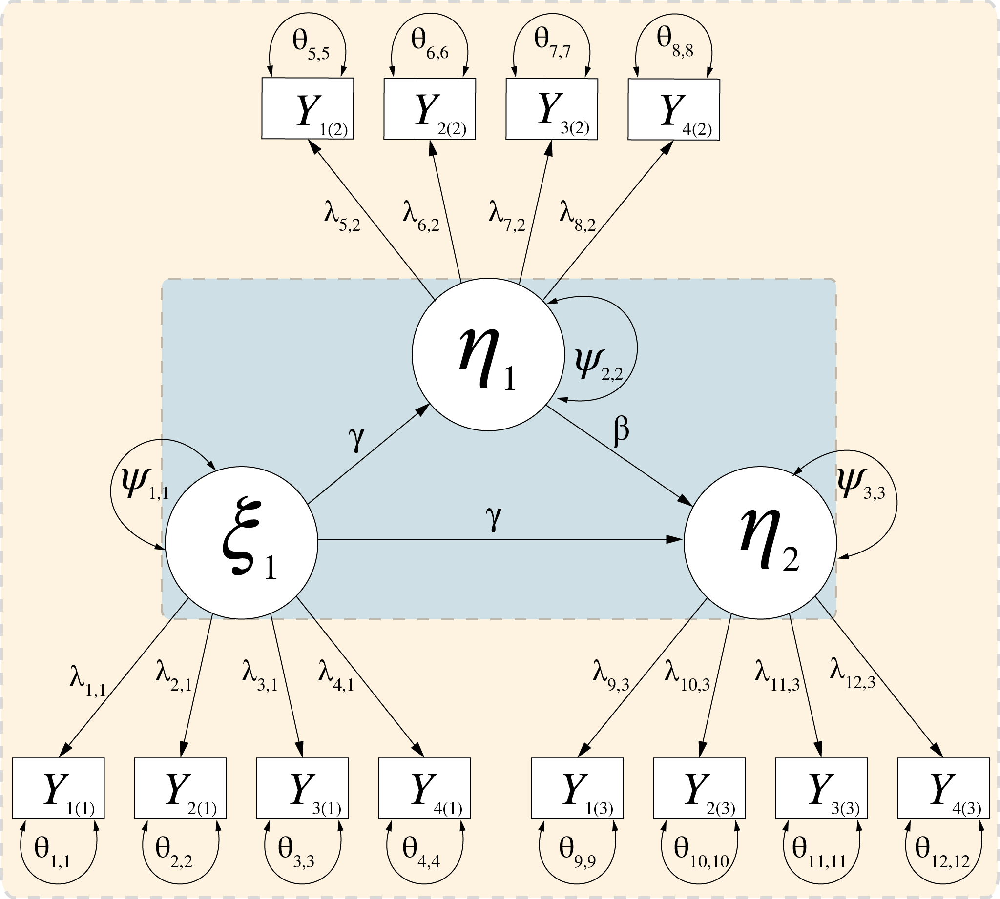
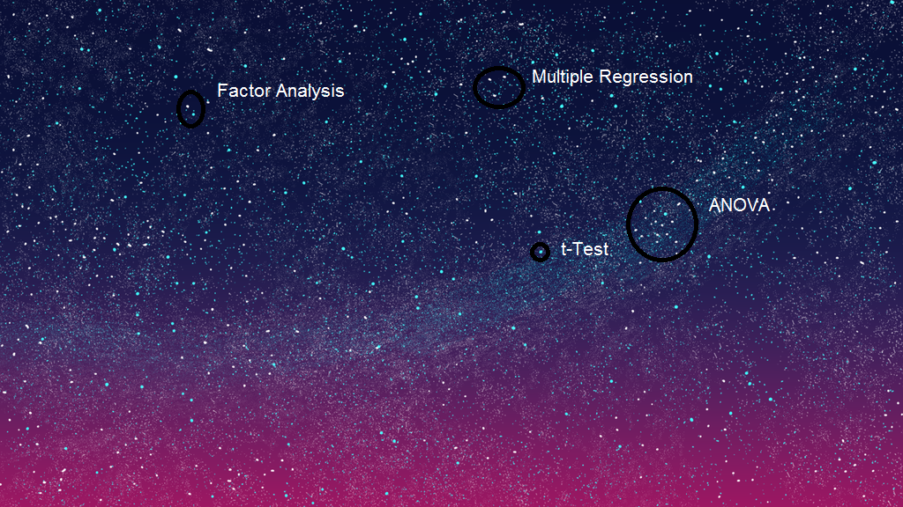
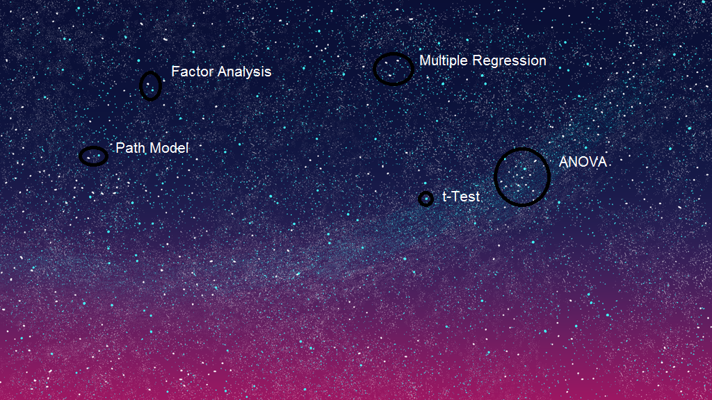
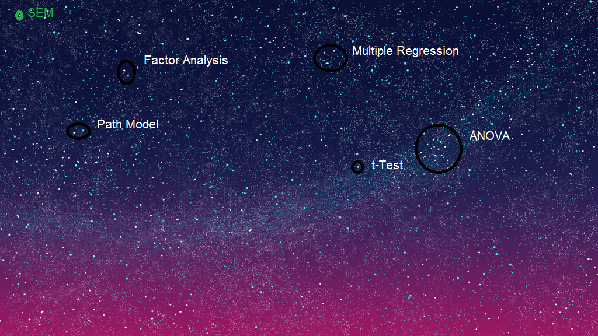
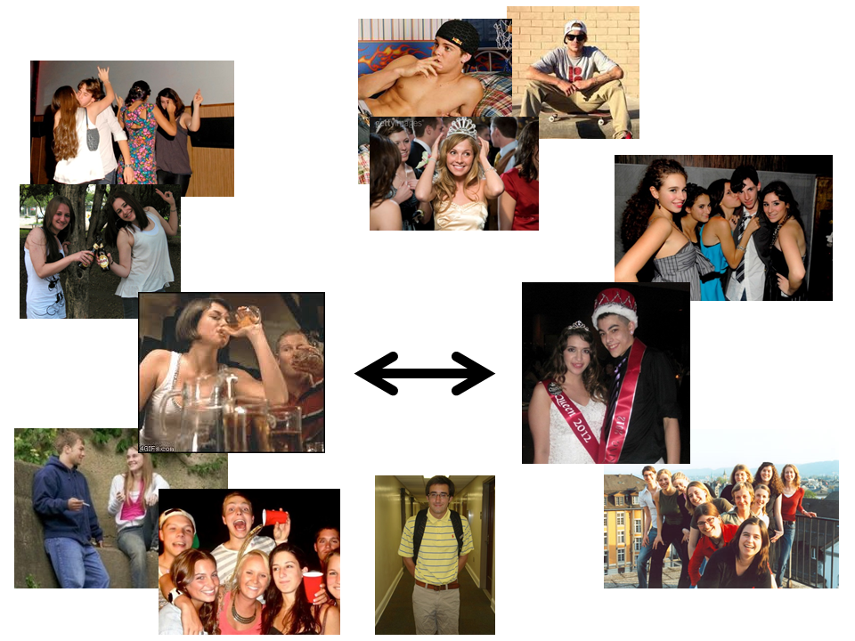
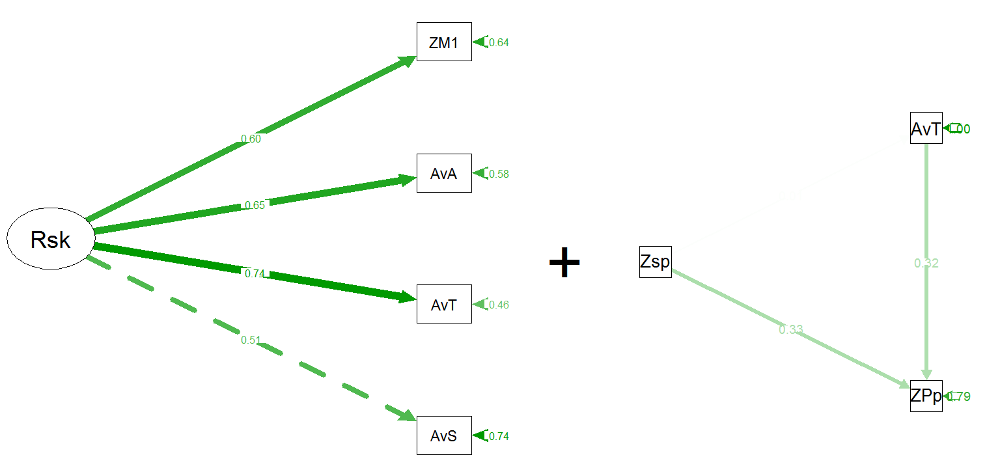

<!-- WELCOME & FLYER-SLIDE -->

<div align="center">

</div>

---

<!-- SNEAK PREVIEW -->

<div align="center">

</div>

---

Equip yourselves!

<div align="center">

</div>

### 

---

<!-- HEADLINE ONLY -->

## Structural Equation Modelling (SEM)

---

## A Million years ago...

---

## (about 1970)

---

## The Stats Universe!

<div align="center">

</div>

---

<!-- STARRY NIGHT 2: t-Test -->

## The Stats Universe

<div align="center">

</div>

---

<!-- STARRY NIGHT 3: ANOVA -->

## The Stats Universe

<div align="center">

</div>

---

<!-- STARRY NIGHT 4: MultReg -->

## The Stats Universe

<div align="center">

</div>

---

<!-- STARRY NIGHT 5: FA -->

## The Stats Universe

<div align="center">

</div>

---

<!-- STARRY NIGHT 6: PM -->

## The Stats Universe

<div align="center">

</div>

---

<!-- STARRY NIGHT 7: semI -->

## The Stats Universe

<div align="center">

</div>

---

<!-- STARRY NIGHT 8: SEMII -->

## The Stats Universe

<div align="center">

</div>

---

<!-- TRANSITION INTRO -> JOURNEY -->

## The World of
## Structural Equation Modelling

<div align="center">

</div>

---

<!-- TRANSITION INTRO -> JOURNEY II -> Question -->

## What can
## SEM do?

<div align="center">

</div>

---

<!-- JOURNEY
to explore how SEM managed to conquer a large part of the universe of statistics
within few decades, let us take a look at what SEM can do...
...in a context that is a bit more down to earth
and better graspable for us...
...Sex!
-->

## What can
## SEM do?

<div align="center">

</div>

---

# Research Question

## How are Risk Behaviour and Social Status Related in Adolescence?

<div align="center">

</div>

---

### Data

### *N* = 408 students, 10th/11th grade (about 17 years)
### Austria, the Netherlands 

* Risk behaviour
    + Sex (Intercourse)
    + Drugs (Tobacco, Alcohol, Marijuana)

* Social status
    + Popularity  ("who is popular?")
    + Likeability ("who yo dou like?")

* Prosocial behaviour
    + Who is nice? Who is helpful? Who cheers others up?

* Antisocial behaviour
    + Who is mean? Who bullies others? Who excludes others?
 
* Positive characteristics
    + e.g., Sporty, good in school

---

## Software preparation

open *R*!


```r
# Set working directory
setwd("C:/Users/petere/Desktop/SEM_WS")
```

---

## Software preparation


```r
# Install packages needed for analysis
 install.packages("foreign", "semPlot",
 "lavaan", "psych", "semTools")

# Load packages needed for analysis
library(foreign) # Package to read SPSS data
library(lavaan) # Package for SEM
library(semPlot) # Package to draw SEMs
library(psych) # Package for descriptive statistics
library(semTools) # Package for multigroup analysis
```

---

## Loading and preprocessing the data


```r
# Read data from SPSS file into dataframe
risk <- read.spss("data/Datafile Workshops.sav", 
                  use.value.labels=TRUE,
                  max.value.labels=Inf,
                  to.data.frame=TRUE)

View(risk)
```

---

## Is gender related to the frequency of risk behaviour?

---

<!-- What do we use? -> The t-Test! -->

## The Stats Universe

<div align="center">

</div>

---

## t-Test


```r
# 2.2 Using regular t-test
summary(lm(risksum~Gender))

# 2.3 Using SEM t-test model
model2 <- '# Regressions: t-test model
           risksum~Gender'
fit_model2 <- cfa(model2,
                  data=risk,
                  missing="ml")
summary(fit_model2)
```

---

## Does risk behaviour depend on adolescents' popularity?

---

<!-- What do we use? -> A regression! -->

## The Stats Universe

<div align="center">

</div>

---

## Regression/correlation


```r
# 3.2 Using regular regression
summary(lm(risksum~ZPop))

# 3.3 Using SEM
model3 <- '# Regressions: Megression model
           risksum~ZPop'
fit_model3 <- cfa(model3,
                  data=risk,
                  missing="ml")
summary(fit_model3)
```

---

## Does risk behaviour depend on adolescents' popularity and likeability?

---

## Multiple Regression


```r
# 4.1 Using regular multiple regression
summary(lm(risksum~ZPop+ZLike))

# 4.2 Using SEM
model4 <- '# Regression: Multiple
          risksum~ZPop+ZLike'
fit_model4 <- cfa(model4,
                  data=risk,
                  missing="ml")
summary(fit_model4)
summary(lm(risksum~ZPop+ZLike))
```

---

## Is there a general tendency to engage in risk behaviour?

---

<!-- What do we use? -> A factor analysis! -->

## The Stats Universe

<div align="center">

</div>

---

## Confirmatory Factor Analysis


```r
model5 <- '# CFA: Unidimensional model
          # Risk Behaviour Factor
          Risk=~AvrSex + AvrTob + AvrAlc + ZMar1
          '
fit_model5 <- cfa(model5,
                  data=risk,
                  missing="ml")
summary(fit_model5,
        fit.measures = TRUE,
        standardized = TRUE)
```

---

## Does engagement in sports lead to less smoking, in turn leading to less popularity?

---

<!-- What do we use? -> A Path analysis/mediation model! -->

## The Stats Universe

<div align="center">

</div>

---

## Path Analysis


```r
model6 <- '# Mediation model
# Risk Behaviour Factor
ZPop ~ AvrTob + Zsport
AvrTob ~ Zsports
'
fit_model6 <- cfa(model6,
                  data=risk,
                  missing="ml")
summary(fit_model6,
        fit.measures = TRUE,
        standardized = TRUE)
```

---

## Summary: What can SEM do?

- Estimate classical models
    * Advantages in SEM:
   "Corrections" for Missing data, non-normality, clustered sampling

- Estimate handy modern models
    * Confirmatory Factor Analysis:
    Correction for measurement error
    * Path Analysis:
    Examine complex causal chains

---

## So What?

---

## Full SEM Power!

Combine *Latent Variables*
with *Structural* (Path) Models

<div align="center">

</div>

---

## Full SEM Power!

Examine *Complex Theories*
with *Error Free* Constructs

<div align="center">

</div>

---

<div align="center">

</div>

---

## A "Small " Theory...


```r
model7 <- '# SEM:
# Risk Behaviour Factor
Risk =~ AvrSex + AvrTob + AvrAlc + ZMar1
# Regressions
ZPop ~ Risk
ZLike ~ Risk
# Correlation
ZLike ~~ ZPop
'
fit_model7 <- sem(model7,
                  data=risk,
                  missing="ml",
                  estimator="MLR",
                  fixed.x=FALSE)
summary(fit_model7,
        fit.measures = TRUE,
        standardized = TRUE)
```

---

## A "Small" Theory...

<div align="center">

</div>

---

## The Full Model


```r
model8 <- '# SEM:
          # Risk Behaviour Factor
          Risk =~ AvrSex + AvrTob + AvrAlc + ZMar1
          ProSoc =~ Zcheers + Zhelpful + Znice
          AntSoc =~ Zmean + Zbullies + Zexclude
          # Regressions
          ZPop ~ Risk + ProSoc + AntSoc + Zattrac + Zsports
          ZLike ~ ProSoc + AntSoc + Zattrac        
          # Correlations
          ZPop ~~ ZLike
          Risk ~~ Zsports
          Risk ~~ 0*ProSoc
'
fit_model8 <- sem(model8,
                  data=risk, missing="ml",
                  estimator="MLR", fixed.x=FALSE)
summary(fit_model8, fit.measures = TRUE,
        standardized = TRUE)
```

---

## The Full Model

<div align="center">

</div>

---

## Drawbacks

---

## Model fit statistics

- Does my model adequately represent the data?

- Fit statistics: RMSEA, CFI, SRMR
    * Rules of thumb "for beginners"

- Strong theory, inspection of residuals and modifications
    * "You" know what to expect from the data
    * Residual variances and covariances
    * Modifcation indices: What would improve model fit?

---

## Overblown fancyness

- Don't assess 27 scales!
    * SEM won't "reveal" anything

---

## Modeling weak measurement

- SEM is not a panacea for weak measures!
    * Questionnaire, coding system,...
